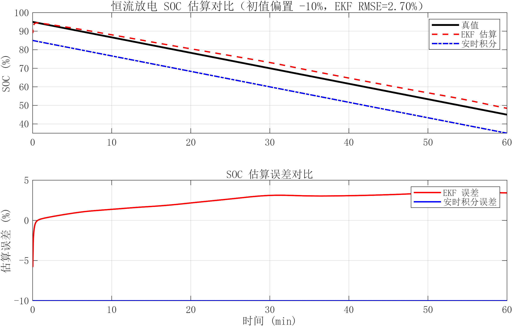
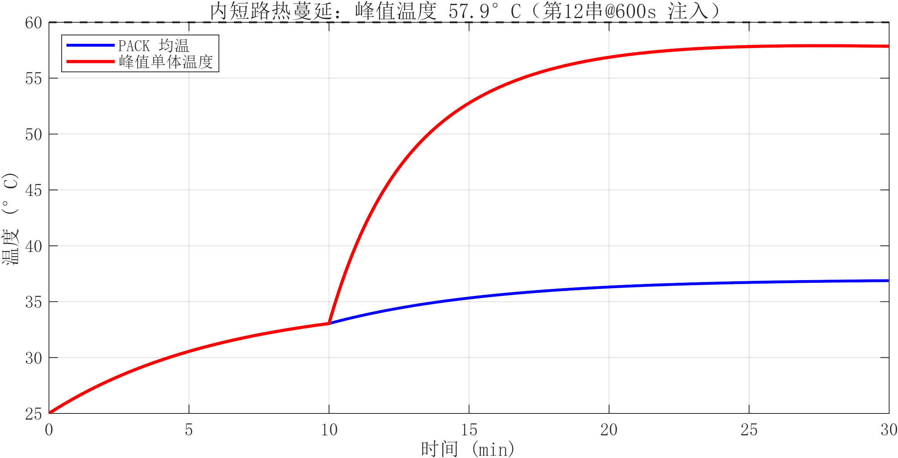
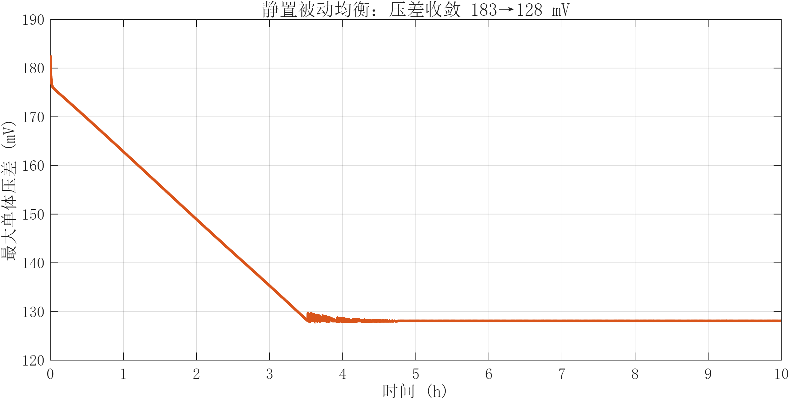
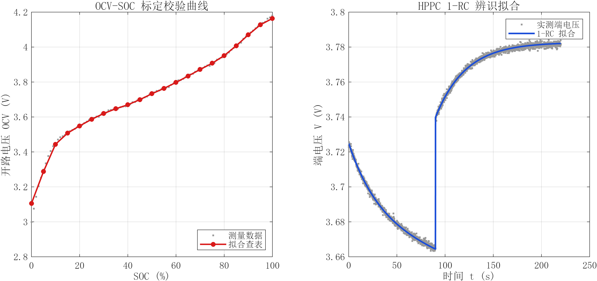
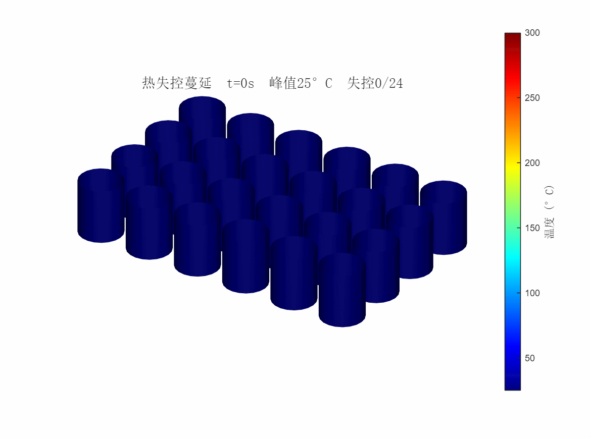
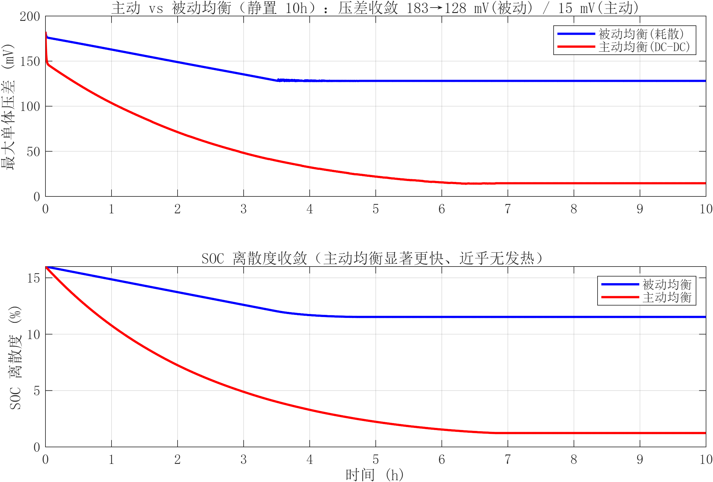
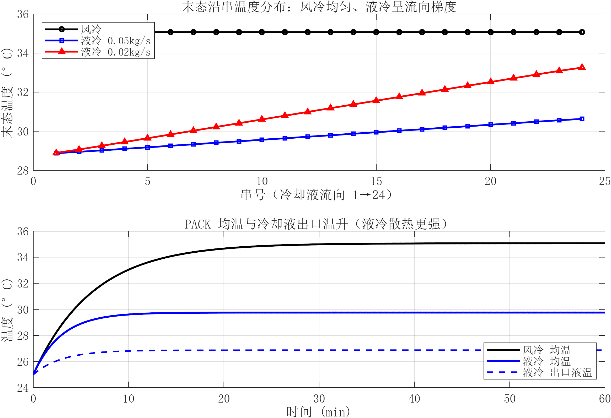
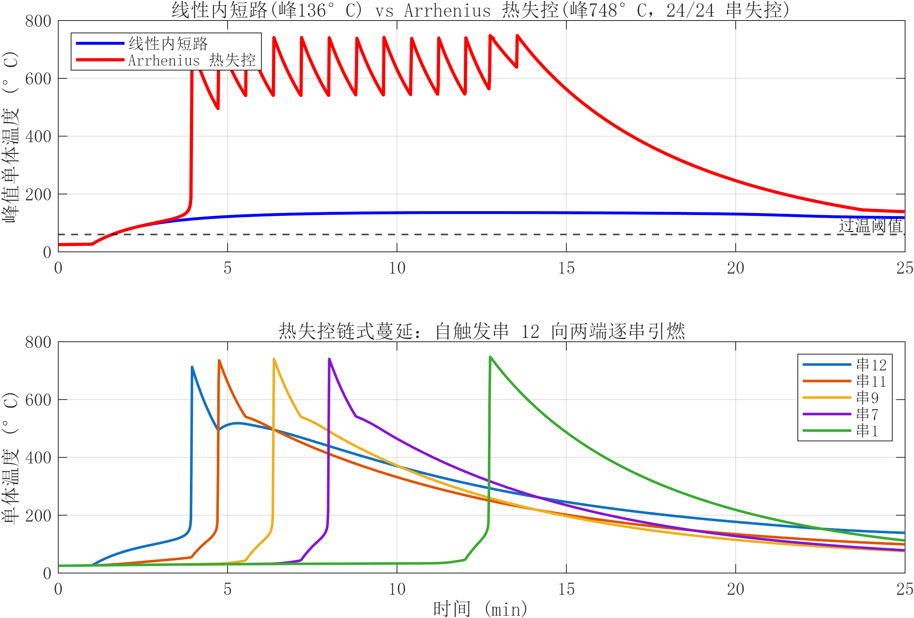
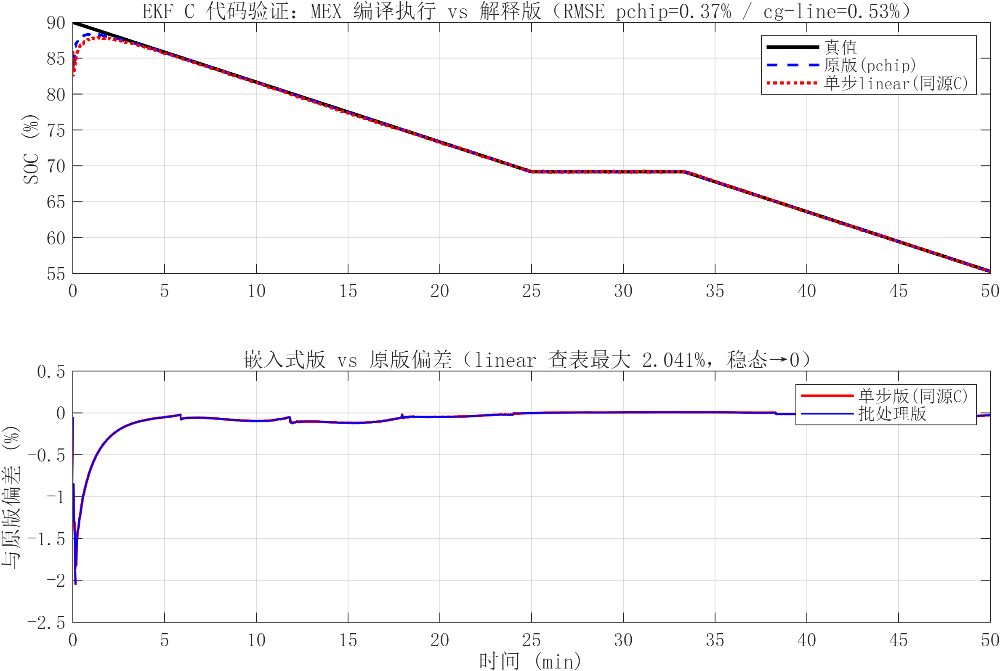

# BMS_Pack_Simulation

> 基于 MATLAB Simscape Battery 的动力电池 PACK + BMS 全链路仿真平台


圆柱锂电 **单体 → 模组 → 整包 PACK** 多尺度电气 + 热耦合仿真；两类 SOC 算法（安时积分 / EKF）对比；被动均衡与故障注入（过压 / 欠压 / 过温 / 内短路）；3D 温度色阶动态可视化。一键完成参数标定 → 批量多工况仿真 → 自动出图，可直接开源存档。


> 24S12P 整包 3D 温度场：第 12 串 600s 注入内短路后的热蔓延动态（蓝 25°C → 红 60°C）

## 核心特性

- **多尺度电-热耦合**：18650 圆柱电芯一阶 Thevenin 等效 + 集总热容 + 相邻串一维热传导 + 风冷对流，温度反馈修正内阻。
- **双 SOC 算法对比**：安时积分（对照组，存在漂移）vs EKF（端电压在线修正），初值偏置 -10% 下 EKF RMSE **0.22%–2.70%**。
- **被动均衡**：单体电压高于（均值 + 阈值）投入耗散电阻，带迟滞防抖。
- **故障诊断**：阈值法（过压/欠压/过温/低温）+ MAD 鲁棒离群（内短路自放电检测）。
- **自动可视化**：`batteryChart` 风格 3D 温度场 GIF + 曲线图，300 dpi 中文出图，直供 GitHub 渲染。

## 仿真效果

| EKF SOC 估算对比 | 内短路热蔓延温升 |
|:---:|:---:|
|  |  |
| **被动均衡压差收敛** | **OCV-SOC 标定校验** |
|  |  |

## PACK 规格（实测标定值）

| 项目 | 参数 | 项目 | 参数 |
|---|---|---|---|
| 拓扑 | 24S12P | 标称电压 | 86.4 V |
| 电芯 | 18650 / 3.0 Ah | 电压范围 | 60.0 – 100.8 V |
| PACK 容量 | 36 Ah | 总能量 | ~3.11 kWh |
| 内阻 R0 | 25.2 mΩ | 极化 R1 | 15.1 mΩ |
| 时间常数 τ | 31.1 s | RC 电容 C1 | 2053 F |

> 参数由 `02_Src_Code/calibrate_pack_param.m` 从 HPPC 脉冲数据辨识（一阶 RC，`lsqcurvefit` 拟合完整端电压并扣除 OCV 漂移），OCV-SOC 查表 21 点（3.105 – 4.164 V）。

## 仿真工况与关键指标

| 工况 | 描述 | EKF RMSE | 现象 |
|---|---|---|---|
| **CC** | 标准恒流放电 0.5C / 1h | 2.70% | 温升 25→35.1°C，压差 38→26 mV |
| **WLTC** | 车载动态工况 30min | 1.43% | 1507s 触发欠压保护，峰值 39.3°C |
| **ISC** | 第 12 串 600s 注入内短路 | 1.86% | 1038s 检出内短路，峰值 57.9°C |
| **Balance** | 静置被动均衡 10h | 0.22% | 压差收敛 183→128 mV |

> 安时积分对照组在 -10% 初值偏置下全程恒定 ~10% 误差，EKF 凭端电压修正快速收敛——SOC 算法优势清晰可见。

## 拓展能力（流程 7.2）

在基础四工况之上新增三类高级仿真能力，由 `Run_Extended_Sim` 调度、`pack_simulator` 内核增强实现（新增 `opt` 字段默认保持原行为，向下兼容，原 4 工况回归不变）。



> 热失控链式蔓延：第 12 串内短路触发 Arrhenius 自产热，约 49 s/串 向两端逐级引燃（蓝 25°C → 红 300°C+）

| ① DC-DC 主动均衡 | ② 液冷热管理 | ③ Arrhenius 热失控 |
|:---:|:---:|:---:|
|  |  |  |

- **① DC-DC 主动均衡**：集中式电荷转移（高 SOC 串 → 低 SOC 串，效率 90%）。静置 10h 压差 183→**15 mV**（被动仅 →128 mV），SOC 离散度 16%→1.2%，峰温仅 +0.35°C——能量利用率远高于耗散式被动均衡。
- **② 液冷热管理**：冷却液沿串流动的分布式换热，峰温较风冷降 **4.5°C**，并复现沿流向温度梯度（流量越低梯度越大，0.02 kg/s 时达 4.4°C）。
- **③ Arrhenius 热失控**：单步自产热 `q = H·A·cⁿ·exp(-Ea/RT)` + 反应物耗尽自限。相同强内短路下，线性产热稳定 **136°C**，开启自产热则正反馈失控至 **748°C** 并链式蔓延全包，清晰揭示热失控危险性。
- **④ EKF C 代码生成（STM32）**：`ekf_soc_step_cg.m` 经 Embedded Coder 生成**单步调用、persistent 状态、定长内存（无 malloc）的可移植 C 源码**（`codegen_ekf/ekf_soc_step_cg.c/.h`，~186 行），可直接集成进 STM32 工程（Keil/STM32CubeIDE，Cortex-M4F/M7 带 FPU）。无目标硬件下以 MATLAB 层等价性验证替代 PIL（三版逐位对比：原版 pchip RMSE 0.37%、cg-linear 0.53%、单步=批处理差 0）。



## 目录结构

```
BMS_Pack_Simulation/
├── asset/            # 可视化素材：GIF、PNG（README 插图源）
├── 01_Model/         # Simscape Battery 自定义库（Pack_Lib，24S12P 模组级）
├── 02_Src_Code/      # BMS 核心算法 .m（SOC、均衡、故障诊断、参数标定、仿真器）
├── 03_Data/          # 电芯测试 CSV、Pack_Param.mat、仿真输出
│   ├── Cell_Test_Data/   # OCV-SOC / HPPC 脉冲试验数据
│   └── Sim_Out_Result/   # 各工况仿真输出 CSV
├── 04_Script_Auto/   # 一键仿真、绘图、3D 截图脚本
├── 05_doc/           # 设计文档 design.md
├── startup.m         # 工程初始化：加路径、加载全局参数
└── README.md
```

## 快速启动

> 环境要求：MATLAB R2025a+，需 Simscape Battery（建模脚本 `Build_Pack_Model.m` 用）；纯数值仿真与算法验证仅需基础 MATLAB + Optimization Toolbox（标定用 `lsqcurvefit`）。

1. MATLAB 当前文件夹切换到工程根目录 `BMS_Pack_Simulation/`，初始化：
   ```matlab
   startup
   ```
2. （可选）从测试数据重新标定参数，生成 `Pack_Param.mat`：
   ```matlab
   calibrate_pack_param      % 缺测试数据时先运行 gen_synthetic_cell_data
   ```
3. 批量多工况仿真，自动导出 CSV 到 `03_Data/Sim_Out_Result/`：
   ```matlab
   results = Run_All_Sim;
   ```
4. 一键出图，PNG / GIF 写入 `asset/`：
   ```matlab
   Plot_Result(results);     % 3 张曲线图
   Show_3DPack(results);     % 3D 温度场 GIF + 封面
   ```
5. （拓展 7.2）跑主动均衡 / 液冷 / 热失控工况并出图：
   ```matlab
   ext = Run_Extended_Sim;   % 3 类拓展工况
   Plot_Extended(ext);       % 3 张对比图
   Show_Runaway(ext);        % 热失控蔓延 GIF
   ```
6. （可选）运行算法单元测试（15 项）：
   ```matlab
   runtests('test_bms_algorithms')
   ```
7. （拓展 ④）生成 EKF 嵌入式 C 代码并做等价性验证：
   ```matlab
   Build_EKF_Ccode;          % 生成 STM32 可集成 C 源码 → 02_Src_Code/codegen_ekf/
   Verify_EKF_Ccode;         % 数值等价性验证（PIL 算法层替代）
   ```

## 算法模块

| 文件 | 功能 |
|---|---|
| `coulomb_counting_soc.m` | 安时积分 SOC（对照组） |
| `ekf_soc_estimator.m` | 一阶 Thevenin EKF-SOC，状态 `[SOC; Vrc]`，端电压在线修正 |
| `passive_balancing.m` | 被动均衡阈值控制 + 迟滞 |
| `fault_diagnosis.m` | 过压/欠压/过温/低温 + MAD 鲁棒离群内短路诊断 |
| `pack_simulator.m` | 24 串电-热-故障耦合数值仿真器（纯函数，含均衡/液冷/热失控） |
| `active_balancing.m` | DC-DC 主动均衡电荷转移分配 |
| `arrhenius_heat.m` | 热失控单步 Arrhenius 自产热与反应物消耗 |
| `ekf_soc_step_cg.m` | EKF 单步嵌入式版（persistent 状态，供 STM32 C 代码生成） |
| `calibrate_pack_param.m` | OCV-SOC 拟合 + HPPC 一阶 RC 辨识 |

## 开发进度

- [x] 1. 目录与初始化（`startup.m`）
- [x] 2. 参数标定（`Pack_Param.mat`，HPPC 一阶 RC 辨识）
- [x] 3. 模型搭建（`Pack_Lib`，24S12P 模组级 Simscape 库 + 数值仿真器）
- [x] 4. 算法开发（SOC / 均衡 / 故障诊断，8 项单元测试通过）
- [x] 5. 批量仿真（`Run_All_Sim.m`，4 工况，EKF RMSE 0.22–2.70%）
- [x] 6. 素材与曲线生成（3 张曲线图 + 3D 温度场 GIF/封面）
- [x] 7. 文档落地（README + `05_doc/design.md`）

### 流程 7.2 拓展能力

- [x] ① DC-DC 主动均衡（`active_balancing.m`，主/被动对比）
- [x] ② 液冷热管理精细化（沿流向冷却液节点链，温度梯度）
- [x] ③ Arrhenius 热失控（`arrhenius_heat.m`，触发/链式蔓延/自限）
- [x] ④ EKF C 代码生成（`ekf_soc_step_cg.m` → Cortex-M C 源码，等价性验证 RMSE 0.53%，位级一致）

> 单元测试 15 项全通过；新增 `Run_Extended_Sim` / `Plot_Extended` / `Show_Runaway` / `Build_EKF_Ccode` / `Verify_EKF_Ccode`。
> ④ PIL 约束：真 PIL 需目标硬件；SIL/MEX 需 codegen 兼容的 MinGW（当前 gcc 15.2.0 的 C23 关键字冲突 + ninja 构建子系统不兼容）。作为 PIL 替代方案：MATLAB 层三版逐位等价验证 + C 源码生成可用（`ekf_soc_step_cg` → 定长内存 C 源），验证图 `EKF_Ccode_Verify.png`。

## License

[MIT](LICENSE) © 2026 Boye Dai
